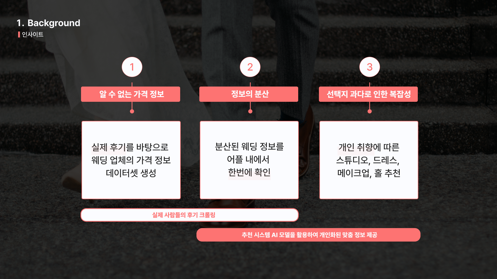
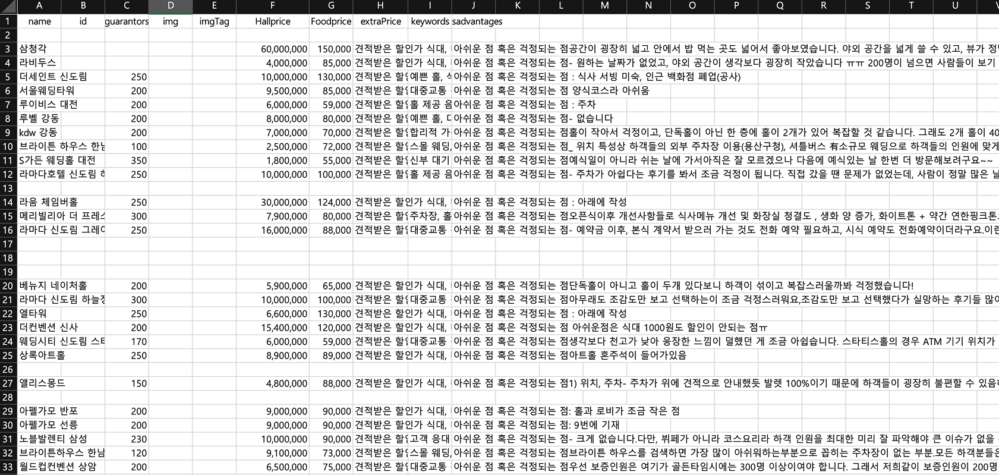

# Warchiving
### 추천시스템 기반 예비 부부들을 위한 웨딩 아카이빙 App

불투명한 웨딩 시장의 정보 비대칭을 해소하고, AI 기반 맞춤형 추천으로 소비자 중심의 거래를 돕는 웨딩 아카이빙 플랫폼입니다.





## 🌐 Introduction Repo Structure
- FE Repo: [프론트엔드 레포지토리](https://github.com/Warchiving/Warchiving-front)
- AI Rec Repo: [AI 추천시스템 레포지토리](https://github.com/Warchiving/Warchiving-AI)


## 🌐 installation(set up)

가장 먼저 AI 레포지토리([링크](https://github.com/Warchiving/Warchiving-AI))에 들어가서 필요한 라이브러리를 설치해주세요. 
```bash
pip install -r requirements.txt

uvicorn main:app --reload # fast api 서버 실행
```


## 🌐 Datasets Info

### Datasets Collection
Wedding datasets 수집: 웨딩 카페([메이크마이 웨딩](https://makemywedding.co.kr/), [아이웨딩](https://www.iwedding.co.kr/brand?category=%EC%9B%A8%EB%94%A9%ED%99%80&subCategory=1&tag=&keyword=&page=1&utm_source=google_sa&utm_medium=cpc&utm_campaign=%EB%A6%AC%EB%93%9C_%EA%B0%80%EC%9E%85_%EC%95%84%EC%9D%B4%EC%9B%A8%EB%94%A9_PC&utm_content=%EC%9B%A8%EB%94%A9%ED%99%80&utm_term=%EC%98%88%EC%8B%9D%EC%9E%A5&gad_source=1&gad_campaignid=20448275692&gbraid=0AAAAAqBQcJwGG64HX_7kayQAdE8yKlJ88&gclid=CjwKCAiA3rPKBhBZEiwAhPNFQMWixxmoHPHGxd1_Toggis_YquZeiU04lN4-oH7PTZOJeVAn1a7kLRoCgz0QAvD_BwE))위주로 한국에 특화된 웨딩 정보 크롤링을 하였습니다.
🔹드레스샵: 드레스의 분위기를 레이블링한 [캐글 데이터셋](https://www.kaggle.com/datasets/tnt2001/weddingdress?resource=download)도 추가하여 이미지기반 학습을 정교화 함.

### Data processing
* 업체마다 다른 보증금, 추가비용, 정가를 .csv 파일로 정리하여 데이터 전처리를 진행하였습니다.


## 🌐 AI Rec(AI 추천시스템)


## 🌐 Members


